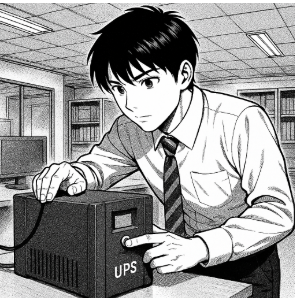

# T02: Selecció d’un SAI per una empresa client
## Enunciat:

L’empresa **TecnoGestió S.L.**, dedicada a la gestió documental i assessorament informàtic, té un petit despatx amb **4 ordinadors de sobretaula**, una **impressora-fotocopiadora multifunció** (similar a les que té l’escola) i un **router d’accés a Internet**.  

Davant les constants incidències amb el subministrament elèctric a la zona, la direcció ha decidit adquirir un **SAI** per garantir la continuïtat del servei i protegir els equips.  

S’han posat en contacte amb l’empresa on esteu fent l’estada i el vostre responsable us ha encarregat que en feu **l’estudi i tria del SAI**.

## Tasques a realitzar

### 1. Inventari d’equips
- Llista dels dispositius que es connectaran al SAI (ordinadors, monitors, router, etc.).  
- Justifiqueu si hi ha algun aparell que **no** hi connectareu al sistema d’alimentació ininterrompuda.  
- Consulta de les **especificacions tècniques** per obtenir el consum de cada dispositiu.  
- Seleccioneu components que s’ajustin als que podríeu trobar-vos a la seu del client.  
- Indiqueu clarament les **dades del component triat** i els valors de **watts (W)** i **voltampers (VA)** corresponents.

---

### 2. Càlcul de potència total
- Valor total de potència.  
- Valor incloent la **reserva del 20%**.

---

### 3. Determinació de l’autonomia
- Estimació del **temps mínim** que el SAI ha de mantenir els equips en funcionament.  
  (Exemple: **10 minuts** per guardar treballs i apagar correctament.)

---

### 4. Recerca de models de SAI
- Cerca de **2 o 3 models de SAI** que compleixin els requisits.  
- Comparació de característiques:
  - Potència  
  - Autonomia  
  - Tipus de sortides  
  - Preu  
  - Marca

---

### 5. Informe tècnic
Redacció d’un informe amb:
- Càlculs realitzats  
- Models analitzats  
- Justificació de la selecció final

## Solució
A l'arxiu [solucio.md](solucio.md) hi ha la solució descrita

[Torna a la pàgina principal](../README.md)
