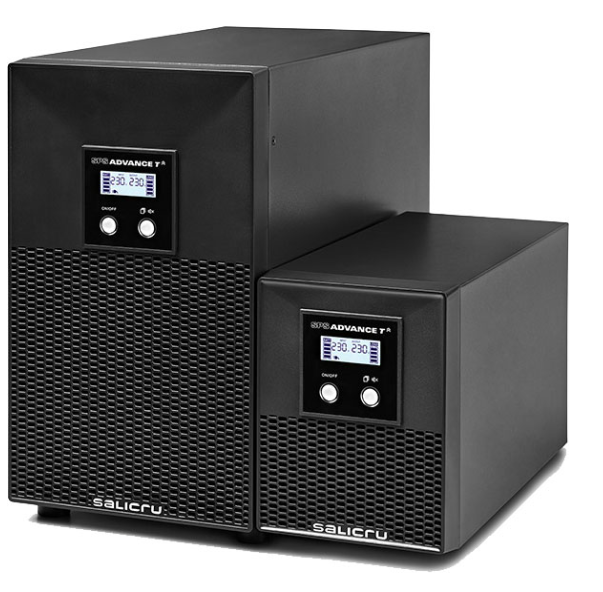
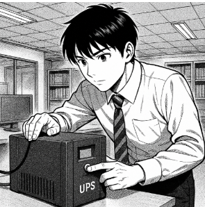

# Tasca 2: Informe tècnic: selecció de SAI per a TecnoGestió S.L.

**Nom:** Pau Martínez Sierra  
**Curs:** 2b  
**Mòdul:** Seguretat Informàtica  
**Link doc:** Drive  
**Data:** 2/10/2025  

---

## INDEX

- Inventari d’equips………………………………………… Pàg 4
- Càlcul de potència total………………………………… Pàg 4
- Determinació de l’autonomia…………………………… Pàg 5
- Recerca de models SAI………………………………… Pàg 5
- Conclusió………………………………………………… Pàg 5

---

## Descripció del Cas

L’empresa **TecnoGestió S.L.**, dedicada a la gestió documental i assessorament informàtic, té un petit despatx amb **4 ordinadors de sobretaula**, una **impressora-fotocopiadora multifunció** (similar a les que té l’escola) i un **router d’accés a Internet**.  

Davant les constants incidències amb el subministrament elèctric a la zona, la direcció ha decidit adquirir un **SAI** per garantir la continuïtat del servei i protegir els equips.  

S’han posat en contacte amb l’empresa on esteu fent l’estada i el vostre responsable us ha encarregat que en feu l’estudi i tria del SAI.  

---

## 1. Inventari d’equips

4 ordinadors d’escriptori connectats.  
4 monitors connectats.  
1 router d’accés a Internet connectat.  
1 impressora-fotocopiadora multifunció **no connectada al SAI**  
(Té pics de consum molt alts i no és prioritària en un tall de corrent.)

| Equip | Model / Referència (exemple) | Consum W | Consum VA |
|:------|:-----------------------------|:----------|:-----------|
| Ordinador sobretaula | PC oficina estàndard (CPU i SSD, sense GPU gaming) | 150 W | 150 / 0,8 = 187,5 VA |
| Monitor 24" LED | Monitor LED 24" | 25 W | 25 / 0,8 = 31,25 VA |
| Router / switch petit | Router d’oficina | 10 W | 10 / 0,8 = 12,5 VA |
| Impressora multifunció | MFP làser oficina | 400 W | 400 / 0,8 = 500 VA |

---

## 2. Càlcul de potència total

| Equip | Quantitat | Consum W | Consum total W |
|:------|:-----------|:----------|:----------------|
| Ordinador | 4 | 150 W | 4 x 150 = 600 W |
| Monitor | 4 | 25 W | 4 x 25 = 100 W |
| Router | 1 | 10 W | 1 x 10 = 10 W |

**Total en W:** 600 + 100 + 10 = 710 W  
**Total en VA:** 710 / 0,8 = 887,5 VA  

**Total amb reserva (20%):**  
- En W → 710 × 1,2 = **852 W**  
- En VA → 887,5 × 1,2 = **1.065 VA**

---

## 3. Determinació de l’autonomia

Per garantir que els usuaris puguin guardar els treballs i apagar els equips correctament, l’autonomia mínima que ha de proporcionar el SAI és d’uns **10 minuts**.

---

## 4. Recerca de models de SAI

**Model 1: APC Smart-UPS 1500**  
- Potència: 1.500 VA / 1.000 W  
- Autonomia: 10–15 minuts al 50% de càrrega (suficient per a la nostra càrrega de 710 W).  
- Sortides: 6–8 preses protegides.  
- Observacions: gamma professional, permet monitoratge remot i gestió avançada.

**Model 2: CyberPower CP1500PFCLCD**  
- Potència: 1.500 VA / 900 W  
- Autonomia: 10 minuts a mitja càrrega.  
- Sortides: 10–12 preses.  
- Observacions: bona relació qualitat-preu, compatible amb fonts d’alimentació amb PFC actiu.

**Model 3: Eaton 5S1500LCD**  
- Potència: 1.500 VA / 900 W  
- Autonomia: 10 minuts a mitja càrrega.  
- Sortides: 8 preses.  
- Observacions: marca fiable, incorpora pantalla LCD amb informació d’estat.

---

## 5. Conclusió resumida

Dels tres models analitzats, tots cobreixen els requisits de potència i autonomia mínims (**852 W i 10 minuts**).  

**Recomanació:**  
El més recomanat és el **model 1: APC Smart-UPS 1500**, ja que ofereix **major robustesa, opcions de gestió remota i manteniment més senzill**, garantint així la continuïtat del servei i la protecció òptima dels equips crítics de l’empresa.

---

*Informe tècnic sobre selecció de SAI*

[Torna a l'enunciat](README.md)

