# T03: Seguretat Lògica: recuperant accés a sistemes

Un cop instalada la màquina, al iniciar-la prem **(Shift + Qualsevol tecla)** per entrar al menú de Zorin i prem la segona opció **“Advanced options for Zorin”**.

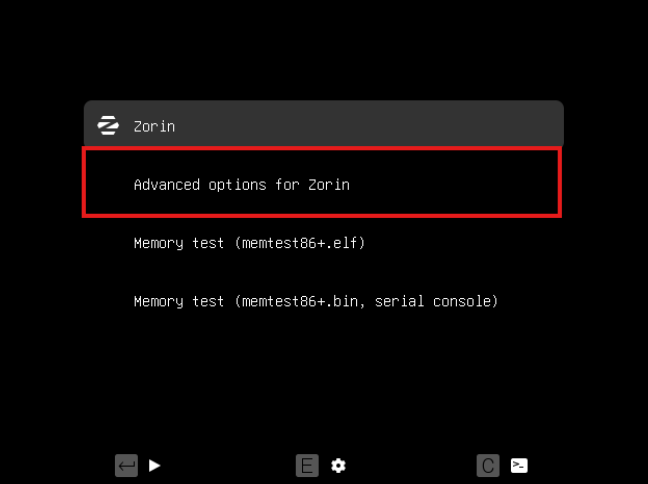

Després, ves a l’opció on diu **“Recovery mode”** i prem **Enter** (pots utilitzar qualsevol de les dues).

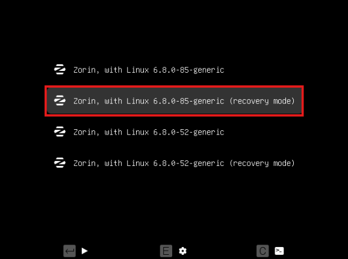

Un cop dins del menú de recuperació, entra en el **root** com surt en la captura per poder canviar la contrasenya.

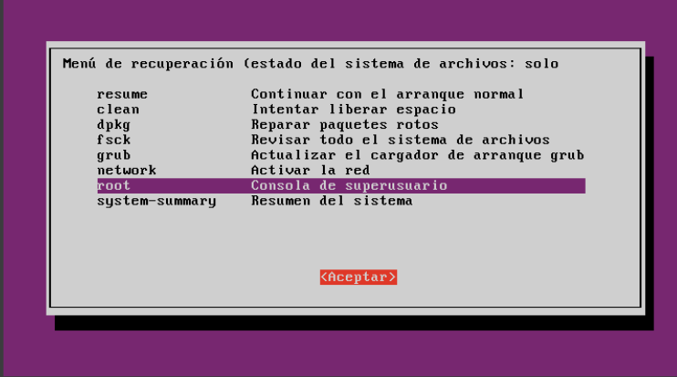

Utilitza “mount -rw -o remount / per poder canviar la contrasenya del usuari.

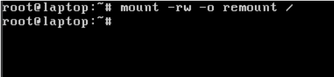

Per trobar el nom d’usuari del usuari utilitza el codi mostrat en la captura

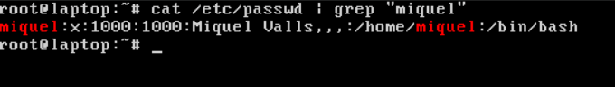

Per canviar la contrasenya escriu “passwd + usuar” (el usuari es el que has trobat anteriorment) i escriu la contrasenya nova.

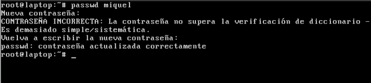

Si heu seguit els passos com diu en aquesta guia, us ha de deixar poder entrar en el usuari.

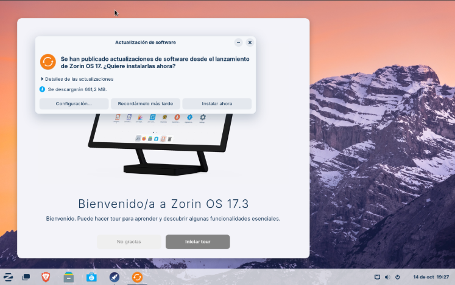

Utilitza “grub-mkpasswd-pbkdf2” per generar un hash a partir d’una contrasenya.

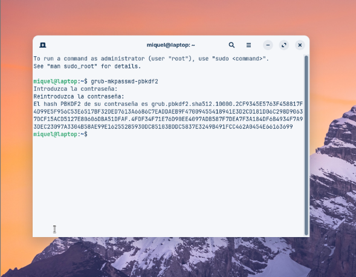

Usa “grub-mkpasswd-pbkdf2 | tee salida.txt per permitir redirigir la sortida estàndard cap a un arxiu.

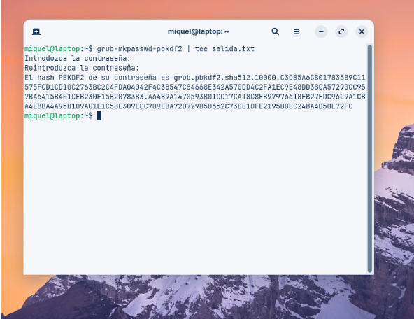

Ara fica “sudo nano -F /etc/grub.d/40_custom” per afegir la autentificació”

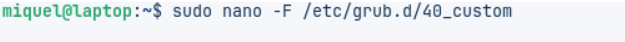

Un cop dins de l'arxiu nano, a la última línea posa “set superusers="nombre_login"
password_pbkdf2 nomre_login” i a la segona linia a continuació del nom utilitzat per el login posa el hash 

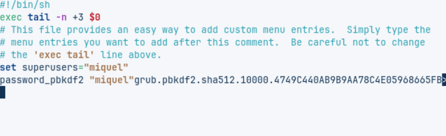

Guarda utilitzant “ sudo grub-mkconfig -o /boot/grub/grub.cfg” i reinicia la màquina

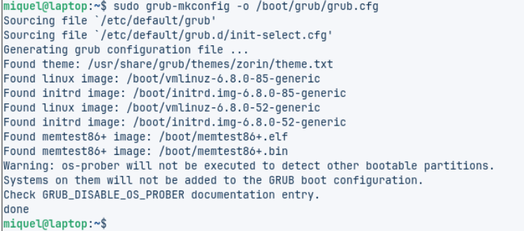

Després de reiniciar, fica el usuari i la contrasenya que has posat anteriorment y ya estaria.
